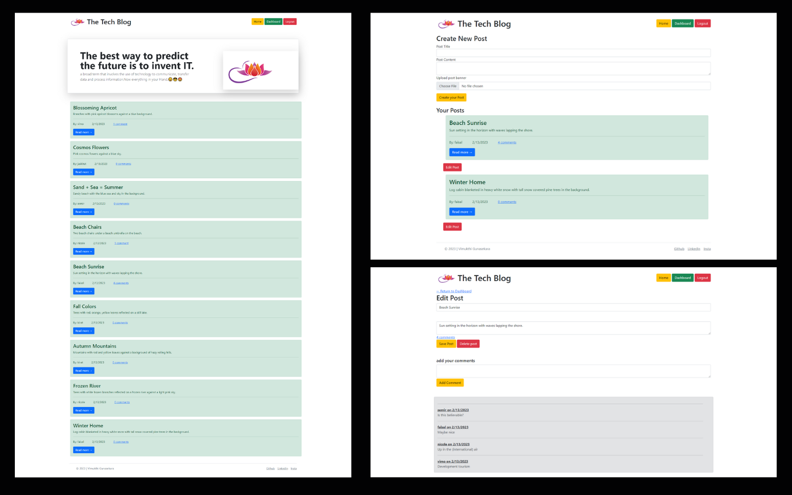

# Tech Blog
        
## 🌟[Description](#table-of-contents)
This platform allows developers to post blogs and comment on each other's posts. The application follows the MVC architecture, and uses Handlebars.js for templating, Sequelize for ORM, and express-session for authentication.


<p>
    
    
    
    
    
    
    
</p>

## Table-of-Contents
* [Description](#description)
* [Submission](#User-Stor)
* [Mock-Up](#Mock-Up)
* [Installation](#installation)
* [License](#License)
* [Contributing](#contributing)
* [FAQs](#faqs)
  
## 🚀 [Submission](#table-of-contents)

Deployed app : https://tech-blog-vg.herokuapp.com/
</br>
Github Page : https://github.com/VimukthiGunasekara/tech-blog/


## 📺 [Mock-Up](#table-of-contents)




## [Video](https://drive.google.com/file/d/1COUAkC41hgmxBc7TYHBdrWZY-PKzXOoW/view?usp=share_link) 


## ⚙️ [Installation](#table-of-contents)
Use your terminal to clone or download or copy the zip file to a directory of your choice. Then open the file in VS Code or whatever editor you use. In VS Code, open the terminal and navigate to e-commerce-back-end in the root directory. 
``` 
npm i
``` 
Run the following command at the root of your project and answer the prompted questions:
``` 
mysql -u root -p
``` 
Enter PW when promted
``` 
source db/schema.sql
quit
npm run seed
npm start
```        
## 📑 [License](#table-of-contents)


Your repository is licensed under an mit open source license, so other people can contribute more easily.More information can be found by clicking this [link.](https://choosealicense.com/licenses/mit)

## 🤝 [Contributing](#table-of-contents)
We are open to all kinds of contributions. If you want to:
* 🤔 Suggest a feature
* 🐛 Report an issue
* 📖 Improve documentation
* 👨‍💻 Contribute to the code

We are excited that you are reading this and are willing to contribute. No need to think big. Even a typo fix might save our day and make you a hero. Every contribution counts!
     
Feel free to check [issues page](https://github.com/VimukthiGunasekara/tech-blog/issues) 
     
## 🤔 [FAQs](#table-of-contents)
Please contact me using the following links :
[Vimukthi Gunasekara](https://github.com/VimukthiGunasekara)


